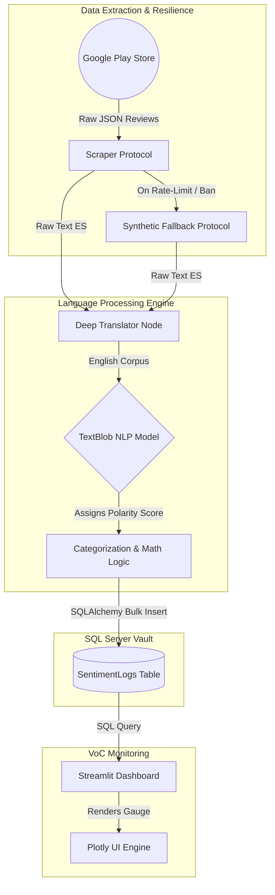

# **CX-NLP-Analytics-Engine**
**BrandPulse: Enterprise Voice of the Customer (VoC) & Reputation Monitoring Pipeline**


---

## **1. Executive Summary**
The **CX-NLP-Analytics-Engine** is a production-ready Natural Language Processing (NLP) pipeline designed to actively monitor, quantify, and visualize brand health and Customer Experience (CX) metrics. By autonomously scraping user feedback from digital distribution platforms (e.g., Google Play Store), the system translates, normalizes, and evaluates unstructured text to extract emotional polarity.

This end-to-end architecture utilizes a deterministic lexicon-based sentiment analyzer, serializing the resulting telemetry into a Microsoft SQL Server database. The data is then surfaced through a real-time Streamlit monitoring dashboard, allowing Product Managers and CX teams to proactively identify software defects or shifts in consumer sentiment before they escalate into systemic churn.

## **2. Business Value & ROI**
In the digital banking and enterprise software sectors, undetected user dissatisfaction directly correlates with user attrition and revenue loss. This engine mitigates those risks by providing:
* **Real-Time Brand Health Auditing:** Transforms subjective, unstructured qualitative reviews into objective, actionable quantitative metrics (Polarity Scores mapping from -1.0 to 1.0).
* **Early Defect Detection:** Rapidly identifies UI/UX breakdowns or critical system failures immediately after a new software update is deployed.
* **Automated Triage:** Replaces manual review-reading with automated categorization (`[ POSITIVE ]`, `[ NEGATIVE ]`, `[ NEUTRAL ]`), drastically reducing the operational overhead for Customer Support teams.

## **3. High-Level System Architecture**
The system enforces a strict separation of concerns, isolating the data ingestion protocol, the mathematical NLP evaluation, and the data visualization layer.



## **4. Core Technical Innovations**
* **Fault-Tolerant Data Ingestion (Resilience Architecture):** Third-party endpoints are volatile and prone to rate-limiting (Soft IP Bans). The scraper module implements a highly defensive fallback mechanism. If the API blocks the request, the system autonomously diverts to a synthetic corporate dataset (`SYNTHETIC_FALLBACK`), ensuring that the downstream NLP pipeline and SQL synchronization never experience a critical failure.

* **Pipeline Idempotency (O(1) Deduplication):** The engine guarantees that multiple consecutive executions will not pollute the database with duplicate records. By querying existing records and leveraging Python `Sets` for algorithmic O(1) lookups (`~df['RawText'].isin(existing_texts)`), the engine only performs inserts on mathematically unique data.

* **High-Performance Memory Injection:** Replaced traditional row-by-row SQL insertions with SQLAlchemy's `fast_executemany=True` Bulk Insert protocol, capable of injecting thousands of records into the database in milliseconds.

## **5. Data Governance & Anomaly Detection**
A standard NLP pipeline blindly trusts text or star ratings. This Enterprise architecture cross-references both variables to detect Sentiment-Rating Incongruence (Sarcasm or User Error).

* If a user submits a 1-Star rating but the NLP detects highly positive text (e.g., "Excellent app, but I hate the bank"), the system flags the record as an Anomaly (IsAnomaly = 1).

* **Data Lineage:** The engine strictly stores the original untampered feedback (`RawText`) alongside the standardized english translation (`TranslatedText`) to allow for full manual auditing of the NLP translation accuracy.`

## **6. Relational Database Schema (SQL Server)**
The persistence layer relies on a structured, ACID-compliant Microsoft SQL Server table (`SentimentAnalysisDB`).

## Database Schema

| Column Name    | Data Type      | Constraint  | Description |
|----------------|----------------|-------------|-------------|
| `ReviewID`       | INT            | PRIMARY KEY | Auto-incrementing unique identifier. |
| `ReviewDate`     | DATETIME       | NOT NULL    | The original timestamp of the user review. |
| `StarRating`     | INT            | NOT NULL    | Quantitative user rating (1 to 5). |
| `RawText`        | NVARCHAR(MAX)  | NOT NULL    | Unaltered source text extracted from the store. |
| `TranslatedText` | NVARCHAR(MAX)  | NULL        | English-translated corpus for NLP ingestion. |
| `SentimentScore` | FLOAT          | NOT NULL    | Continuous polarity vector (-1.0 to 1.0). |
| `Category`       | VARCHAR(50)    | NOT NULL    | Categorical verdict (Positive, Negative, Neutral). |
| `IsAnomaly`      | BIT            | DEFAULT 0   | Boolean flag (1) for detected sarcasm/incongruence. |
| `DataSource`     | VARCHAR(50)    | NOT NULL    | Governance tracker (`REAL_API` or `SYNTHETIC_FALLBACK`). |

## **7. Command & Control Interface**
The analytical frontend is powered by Streamlit and Plotly, delivering immediate situational awareness to stakeholders:

* **Brand Health Gauge:** A mathematical Plotly speedometer summarizing the global average polarity of the dataset.

* **Telemetry Audit Table:** A dynamically color-coded dataframe exposing anomalies (`YES`) and rendering continuous sentiment scores as visual progress bars (`st.column_config.ProgressColumn`).

* **Governance Banners:** Autonomous UI alerts that warn the operator if the pipeline is actively relying on fault-tolerant synthetic data due to upstream network bans.

## **8. Repository Topology**
```
CX-NLP-Analytics-Engine/
│
├── config.py                   # Centralized environment variables and DB connection strings
├── nlp_engine.py               # Extraction, translation, anomaly detection, and Bulk Sync
├── dashboard.py                # Streamlit VoC monitoring interface and Plotly rendering
├── SentimentLogs.sql           # Database DDL schema and table definitions
├── requirements.txt            # Dependency manifest (TextBlob, Streamlit, SQLAlchemy, Plotly)
├── .gitignore                  # Tracking exclusion configurations
└── README.md                   # System architectural blueprint
```

## **9. Enterprise Deployment Protocol**
#### **Step 1: Database Initialization**
Execute the provided T-SQL script (SentimentLogs.sql) within SQL Server Management Studio (SSMS) to establish the relational vault.

#### **Step 2: Environment Provisioning**

```bash
python -m venv venv
source venv/bin/activate  # Windows: venv\Scripts\activate
pip install -r requirements.txt
python -m textblob.download_corpora
```

#### **Step 3: Trigger the NLP Extraction Pipeline**
Execute the ingestion and mathematical core. The script will automatically deduplicate and commit to SQL Server:

```bash
python nlp_engine.py
```

#### **Step 4: Launch the Command Center**
Initialize the local web server to monitor the extracted telemetry in real-time:

```bash
streamlit run dashboard.py
```